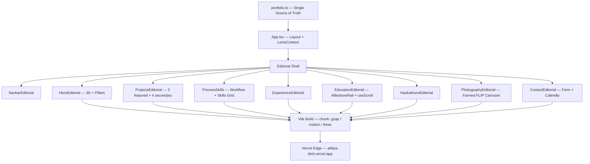
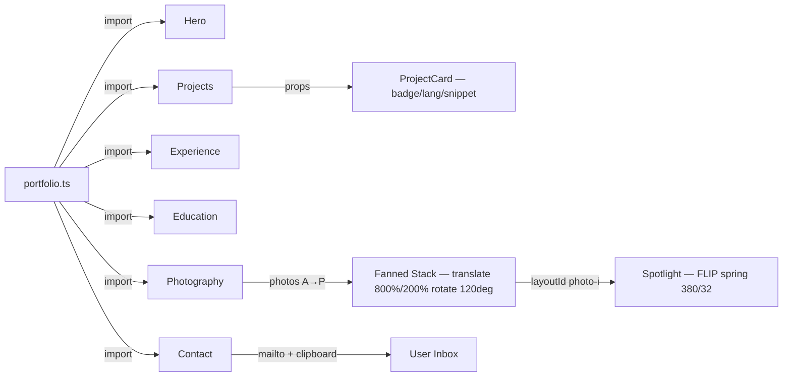
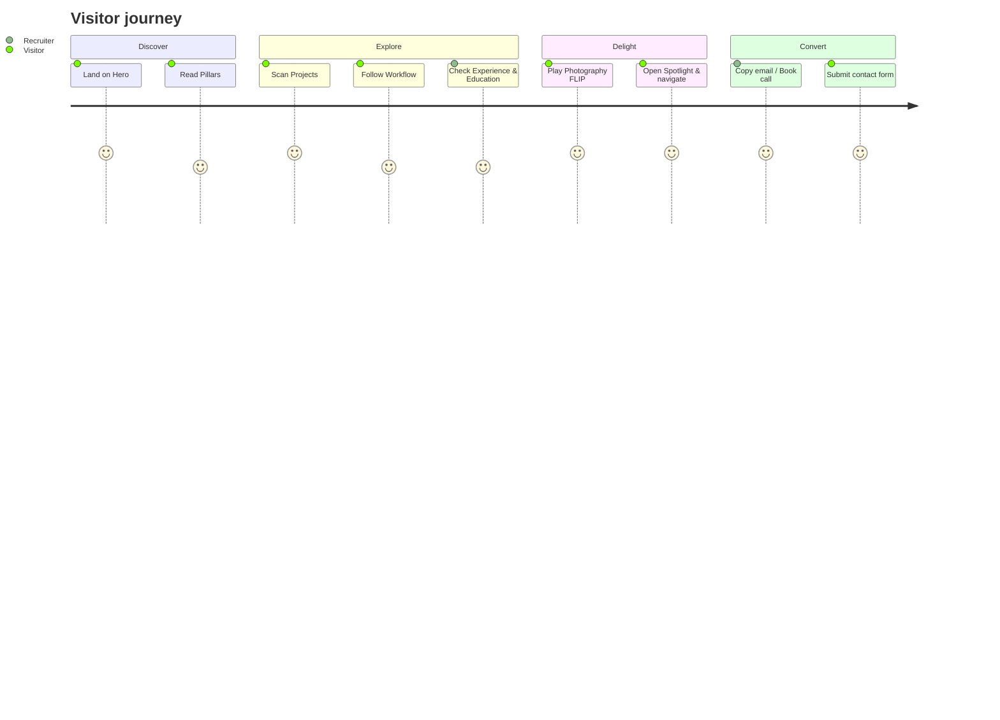
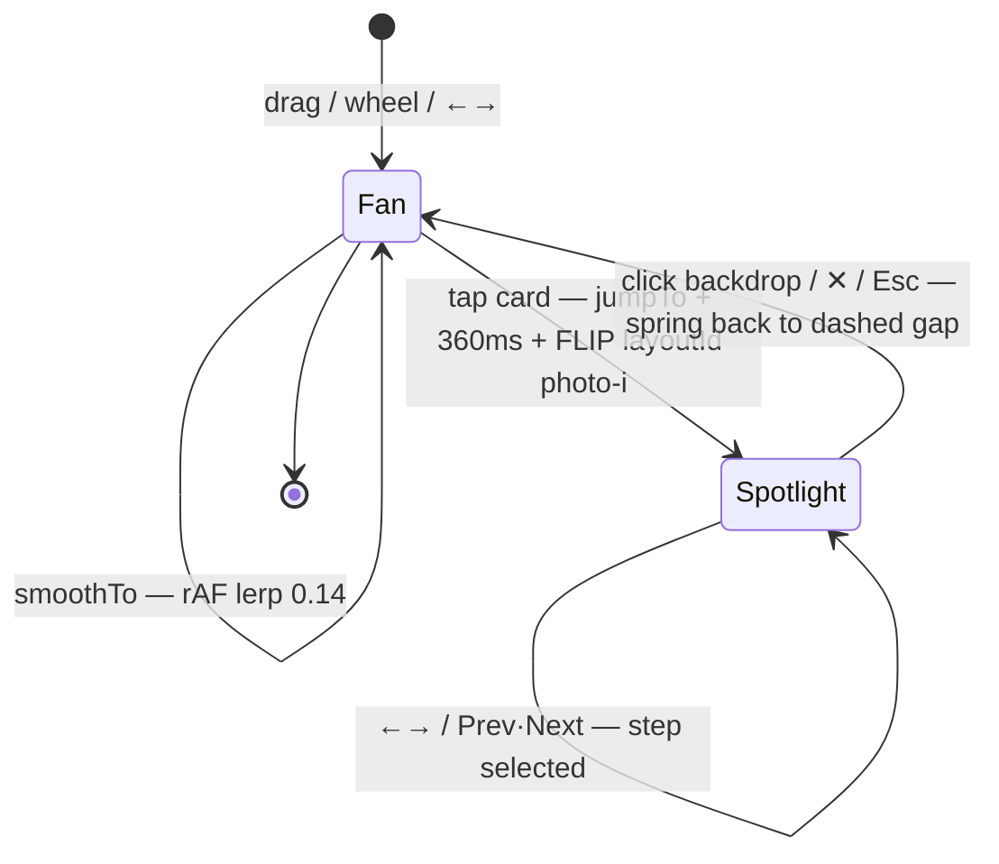

<div align="center">

# ✦ Aditya Dixit — Portfolio

### Editorial · Motion · AI-Native Engineering
**Full-Stack & AI Engineer — Kanpur, India · Crafting production-grade, human-centered products**

[](https://aditya-dixit.vercel.app)
[](https://github.com/Aditya-dxt/Portfolio)
[](https://reactjs.org)
[](https://www.typescriptlang.org)
[](https://vitejs.dev)
[](https://vercel.com)

*National Finalist — India Innovates 2026 · 300+ DSA · MERN + RAG · Bharat Mandapam, New Delhi*

[Live Site](https://aditya-dixit.vercel.app) · [LinkedIn](https://www.linkedin.com/in/aditya-dixit-085862333/) · [GitHub](https://github.com/Aditya-dxt) · [Book a Call](https://calendly.com/adityadxt1910/30min) · [Resume](public/resume/SDE-Resume.pdf)

</div>

---

## 🖼️ Preview

> Replace with a real screenshot after deploy — `public/images/preview.png`


| Hero — Editorial | Projects — Dark | Photography — Spotlight |
|---|---|---|
| Champagne / Navy / Gold typography, pillars | 3 featured dark cards + 4 secondary | 16-frame fanned carousel → FLIP focus |

---

## ✨ What Makes This Portfolio Different

- **Editorial luxury system** — Champagne `#FAF7F0` / Navy `#0F1F3D` / Gold `#C89B3C` / Burgundy `#7A263A`, Playfair Display + JetBrains Mono, hairlines and grain
- **Motion without jank** — Lenis smooth scroll + GSAP ScrollTrigger + Framer Motion FLIP, `prefers-reduced-motion` aware, rAF-lerped carousel
- **Photography spotlight** — 16-image fanned stack (A→P), wheel/drag/arrows, true FLIP: tapped card lifts from its exact spot leaving a dashed vacancy, blurs the bunch, shows full `object-contain` frame, sinks back on outside/✕/Esc
- **Single source of truth** — every word, link, and image in `src/data/portfolio.ts`
- **Production-grade DX** — Vite 6 + React 18 + TS strict, Tailwind 3, code-split chunks (gsap/motion/three), Vercel zero-config

---

## 🛠️ Tech Stack

| Layer | Choice | Why |
|---|---|---|
| Build | **Vite 6** | Instant HMR, Rollup code-split |
| Framework | **React 18** + **TypeScript 5.7** | Strict, component MVVM |
| Styling | **Tailwind CSS 3.4** + custom vars | Editorial tokens, no CSS bloat |
| Motion | **GSAP 3.12** + **@gsap/react** + **Framer Motion 11** + **Lenis 1.1** | Scroll, FLIP, spring physics |
| 3D | **Three.js 0.174** | Hero particle field |
| Icons | **react-icons** | Minimal bundle |
| Deploy | **Vercel** | Edge, preview deploys |

---

## 🏗️ Architecture



### Data Flow



### User Journey



---

## 📂 Project Structure

```
portfolio/
├── public/
│   ├── images/
│   │   ├── photography/   # A.jpeg → P.jpeg (16, alphabetical)
│   │   ├── hackathons/    # 4 event covers
│   │   ├── aditya-hero-3d.png
│   │   ├── college.jpg / school.jpg
│   │   └── contact-profile.png
│   └── resume/SDE-Resume.pdf
├── src/
│   ├── components/
│   │   └── editorial/     # Hero, Projects, ProcessSkills, Experience,
│   │                      # Education, Hackathons, Photography, Contact,
│   │                      # Navbar, Reveal, ScrollProgress, useMagnetic
│   ├── context/LenisContext.tsx
│   ├── data/portfolio.ts  # ← EDIT EVERYTHING HERE
│   ├── hooks/             # cursor, magnet, scramble
│   ├── lib/gsap.ts
│   ├── index.css          # editorial tokens
│   └── App.tsx
├── tailwind.config.ts
└── vite.config.ts
```

---

## 🚀 Getting Started

```bash
# clone
git clone https://github.com/Aditya-dxt/Portfolio.git
cd Portfolio

# install (Node >=18)
npm install

# develop — http://localhost:5173
npm run dev

# production build
npm run build
npm run preview
```

---

## ✏️ Content Editing — One File

**`src/data/portfolio.ts`** — change once, everywhere updates.

| To change | Edit |
|---|---|
| Name, roles, bio, pillars | `name`, `rolesCycle`, `bio`, `pillars` |
| Projects (3 featured) | `projectsFeatured` — badge/lang/snippet/title/subtitle/desc/tags/live/github |
| Projects (secondary) | `projectsSecondary` |
| Skills grid | `skills` — abbr/name/cat/icon |
| Workflow | `process` — 01→05 |
| Experience | `experience` — period/badge/title/role/desc/tags |
| Education + milestones | `education.college` / `education.school` — milestones with `current`/`upcoming`/`grade`/`badge` |
| Hackathons | `hackathons` — venue/date/role/tags/image |
| Photography alts | `PhotographyEditorial.tsx` → `photos[]` — title A→P, alt text |
| Nav / Social / Booking | `nav`, `social`, `bookingUrl`, `resumePath` |

> **Photography:** add new shots as `Q.jpeg`, `R.jpg` … in `public/images/photography/` and append to `photos[]` alphabetically. Counter/dots adapt automatically.

---

## 🌗 Editorial Sections

| # | Section | Anchor | Signature Interaction |
|---|---|---|---|
| 1 | **Hero** | `#` | 3D tilt hero image, pillars, rotating roles |
| 2 | **Projects** | `#projects` | 3 dark featured cards (no load flicker) + 4 secondaries |
| 3 | **Workflow + Skills** | `#process` | 5-step process + branded skill grid |
| 4 | **Experience** | `#experience` | Timeline editorial |
| 5 | **Education** | `#education` | MilestoneRail with `useScroll` gold growth |
| 6 | **Hackathons** | `#hackathons` | 4 national events |
| 7 | **Photography** | `#photography` | Fanned FLIP carousel, 16 frames, spotlight |
| 8 | **Contact** | `#contact` | Magnetic CTAs, copy email, Calendly, validated form |

---

## 🔧 Photography Carousel — UX Spec



- **Frame isolation:** `wheel` with `{passive:false}` + `preventDefault+stopPropagation` inside navy `rounded-[20px] border gold 18%` frame; page doesn't scroll when cursor is inside.
- **Physics:** `progress 0→100`, `active = floor(progress/100*(n-1))`, `translate(800%*off, 200%*off) rotate(120deg*off)`, `zIndex n-|i-active|`, opacity curving.
- **A11y:** `tabIndex 0`, `focus-visible:ring`, `aria-label`, keyboard focus on hover.

---

## 📬 Contact Wiring

Form in `ContactEditorial.tsx` uses `mailto:` + validation and clipboard copy today. To make it live with an endpoint:

1. Create endpoint at [Formspree](https://formspree.io) or [FormSubmit](https://formsubmit.co)
2. Replace `handleSubmit` to `fetch(ENDPOINT, {method:'POST', body: FormData})`
3. Keep `mailto:` fallback for no-JS.

Calendly button uses `bookingUrl` from `portfolio.ts`.

---

## 🚢 Deployment

```bash
npm run build   # → dist/ (ignored by git, built on Vercel)
```

Connect repo at [vercel.com](https://vercel.com) — framework auto-detected as **Vite**. No env vars required. Each push to `main` deploys.

**Custom domain:** `aditya-dixit.vercel.app` (add your domain in Vercel → Settings → Domains).

---

## 📜 Scripts

| Script | What it does |
|---|---|
| `npm run dev` | Vite dev server + HMR |
| `npm run build` | `tsc -b && vite build` — type-check + bundle |
| `npm run preview` | Serve `dist` locally |
| `npm run lint` | ESLint on `src` |

---

## 🤝 Contributing / Reuse

MIT — fork, customize `portfolio.ts`, replace `public/images/*`, ship. A ⭐ is appreciated.

---

## 📈 Roadmap

- [ ] Light/Dark editorial toggle (persisted)
- [ ] MDX case-study pages per project
- [ ] View transitions API for route morphs
- [ ] OG image generation per project

---

<div align="center">

Built with ❤️ by <a href="https://github.com/Aditya-dxt">Aditya Dixit</a> — Kanpur, India

*Photography is not just a hobby — it's how I see the world.*

</div>
